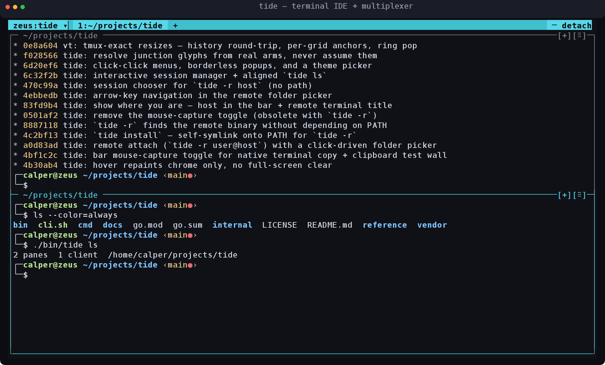
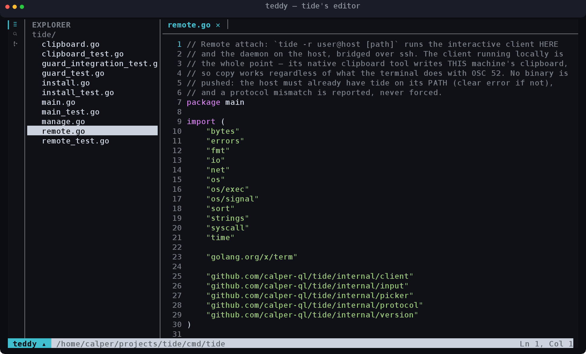

<h1 align="center">tide</h1>

<p align="center">
  <strong>A terminal IDE — a mouse-friendly multiplexer with a session daemon, remote attach over SSH, and a clipboard that just works.</strong>
</p>

<p align="center">
  <a href="LICENSE"></a>
  
  
</p>

<p align="center">
  
</p>

tide keeps a **session daemon** running your shells; a thin **client** attaches to it in
the alt-screen and is pure glass — raw input up, composed frames down. Detach and your
work keeps running; reattach from the same box or from your laptop over SSH. Every pane is
framed and every control is clickable, so splitting, resizing, and switching are
discoverable without memorizing chords — but the chords are there too.

It ships with **`teddy`**, a small terminal editor (a VS Code-lineage activity bar, a file
tree, syntax highlighting) that integrates with tide.

---

## Highlights

- **Persistent sessions.** A session's identity is its project root (found by walking up to
  the `.git`). Layout, splits, focus, and scrollback survive detach — and survive a daemon
  restart. The daemon spawns on demand and exits with its last session.
- **Mouse-first, i3-style tiling.** Every pane has a title bar with `[+]` split and `[≡]`
  menu buttons; clicking a window edge opens a four-way split menu anchored under the
  pointer. Drag a border to resize. Nothing *requires* a mouse — but nothing requires
  hunting for a keybinding either.
- **Remote attach, `tide -r user@host`.** The interactive client runs on **your** machine
  and bridges to the host's daemon over SSH, so **copy lands on your local clipboard** — the
  whole point. No agent to install on the host beyond `tide` itself.
- **Clipboard that actually works.** Selections copy via OSC 52 *and* the platform tool
  (`pbcopy` / `wl-copy` / `xclip` / `xsel`), because plenty of terminals silently drop
  OSC 52. Paste runs through guards (bracketed paste, multi-line confirmation).
- **Themes from your own palette.** tide builds entirely from your terminal's 16 colors and
  default fg/bg — no truecolor required — with one selectable accent. Six presets, applied
  live to every session and client.
- **A real VT.** A scoped terminal per pane answers DSR/CPR/DA queries, models wide glyphs,
  tracks bracketed-paste and mouse modes, and delivers focus events to apps that ask.
- **Self-contained & offline.** All dependencies are vendored; the pinned build runs with
  `--network=none` and re-proves it every time.

## Install

Requires **Go 1.26+** (and `ssh` for remote attach). Linux and macOS.

```sh
git clone https://github.com/calper-ql/tide
cd tide
go build -o bin/ ./cmd/tide ./cmd/teddy   # or: ./cli.sh build  (pinned, offline Docker toolchain)
```

Put the binaries on your `PATH`, or let tide symlink itself:

```sh
./bin/tide install          # symlinks tide onto PATH (default ~/.local/bin), for `tide -r`
```

## Usage

```
tide [path]        attach to the project's session, creating it on demand
tide -r user@host [path]
                   attach a session on a remote host over SSH; the client runs
                   here, so copy lands on this machine's clipboard
tide --here        use the current directory as the project root verbatim
tide ls            list live sessions
tide manage        interactively kill sessions (also: tide -r host manage)
tide kill [path]   end the project's session (the only way a session ends)
tide restart       shut the daemon down and start fresh (version upgrades)
tide install [dir] symlink this binary onto PATH so a non-interactive SSH shell
                   can find it for `tide -r`
```

Inside a session:

| Gesture | Action |
| --- | --- |
| Click a pane's `[+]`, or click a window edge | Split (menu picks the direction) |
| Drag a border | Resize |
| Click a pane's title bar | Focus it |
| Click the session name `▾` | Session menu — new tab, theme, detach, kill |
| **Ctrl+Shift+E**, or the bar's `−` | Detach (the session keeps running) |
| **Ctrl+C** with a selection | Copy (to clipboard *and* the terminal); no selection → sends `^C` |
| **Ctrl+V** | Paste, through the paste guards |
| Wheel | Scroll the pane's scrollback |

### Remote

```sh
tide -r you@server            # land on a session chooser / folder picker on the host
tide -r you@server ~/proj     # attach (or create) the session for ~/proj on the host
```

The host only needs `tide` on its PATH (run `tide install` there once). tide never pushes a
binary and never kills a mismatched daemon — a version mismatch is reported, not forced.

### teddy — the editor

<p align="center">
  
</p>

```sh
teddy [path]       open teddy rooted at a directory, or with a file open
```

An activity bar (explorer / search / source control), a collapsible file tree,
draggable path-labeled tabs, minimal editing with save/undo, chroma-based syntax
highlighting, and a markdown raw/preview toggle. tide owns the tiling; teddy is just the
editor in the pane.

## How it's built

```
cmd/tide            CLI + thin client: alt-screen glass, raw input up, render frames down
cmd/teddy           the editor
internal/daemon     session daemon: lifecycle, the shared input router, the compositor
internal/vt         scoped terminal (a vt10x port) + snapshot renderer + scrollback
internal/protocol   the wire contract (newline-delimited JSON over a user-private socket)
internal/layout     the tab/split tree and its exact tiling geometry
internal/input      input decoder (legacy/kitty/SGR/paste/focus) + per-pane re-encoder
internal/tui        teddy's cell grid + diff renderer
```

The daemon owns everything on screen: pane PTY output parses into daemon-side VT grids, a
per-session compositor renders grids + chrome into positioned-ANSI frames, and clients just
paint them. See **[docs/status.md](docs/status.md)** for the current state and
**[docs/tide-spec-v1.md](docs/tide-spec-v1.md)** for the product contract.

## Development

```sh
./cli.sh build      # build bin/tide and bin/teddy (pinned Docker toolchain)
./cli.sh test       # go test -race ./...
./cli.sh check      # gofmt + go vet
./cli.sh ci         # check + build + test
```

The Docker toolchain runs `--network=none`: the repo must build offline, from itself,
forever — all dependencies are vendored, and every run re-proves it. If you'd rather use a
local Go toolchain, `go build ./...` and `go test ./...` work the same (with `-mod=vendor`).

## Credits

- The per-pane terminal emulator is a port of **[vt10x](https://github.com/hinshun/vt10x)**
  by James Gray (MIT — see [LICENSE-vt10x](LICENSE-vt10x)).
- Syntax highlighting uses **[chroma](https://github.com/alecthomas/chroma)** as a lexer.

## License

[MIT](LICENSE) © Can Alper
